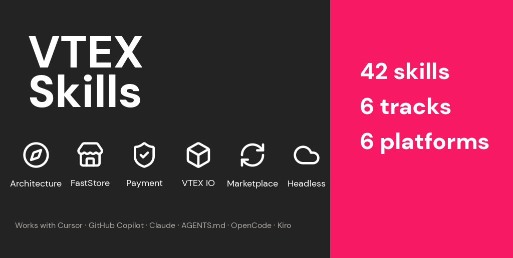

<p align="center">
  
</p>

<h1 align="center">VTEX Skills</h1>
<p align="center">
  <strong>42 AI agent skills for VTEX platform development — one source, six export formats.</strong>
</p>
<p align="center">
  <a href="#quick-start">Quick Start</a> •
  <a href="#tracks--skills">Tracks</a> •
  <a href="#supported-platforms">Platforms</a> •
  <a href="#contributing">Contributing</a>
</p>
<p align="center">
  
  
  
  
  
</p>

---

## Quick Start

Pick your platform and run one command. No clone needed.

### Install all skills with npx (Cursor, Claude Code, Codex, OpenCode, and 38+ agents)

```bash
npx skills add vtex/skills
```

This uses the [open skills CLI](https://github.com/vercel-labs/skills) to install skills into whichever AI agents you have configured. It auto-detects Cursor, Claude Code, Codex, OpenCode, and others. Use `--list` to preview available skills before installing, or `--all` to install everything non-interactively.

### AGENTS.md (Recommended — works with Cursor, Copilot, Codex, Windsurf, Amp, Devin, and more)

```bash
curl -sL https://github.com/vtex/skills/releases/latest/download/agents-md.tar.gz | tar xz -C your-project/
```

This places a root `AGENTS.md` with links to per-track files in subdirectories. Most AI coding tools discover and follow these instructions automatically.

### Cursor

```bash
mkdir -p your-project/.cursor/rules
curl -sL https://github.com/vtex/skills/releases/latest/download/cursor-rules.tar.gz | tar xz -C your-project/.cursor/rules/
```

Each `.mdc` file includes glob patterns that auto-attach the rule when you open matching files. Per-track composites (e.g., `faststore-all.mdc`) are also available.

### GitHub Copilot

```bash
mkdir -p your-project/.github
curl -sL https://github.com/vtex/skills/releases/latest/download/copilot-instructions.tar.gz | tar xz -C your-project/.github/
```

Per-track files are available in `exports/copilot/` if you only need a subset.

### Claude Projects

Upload files from [`exports/claude/`](exports/claude/) as project knowledge in your Claude Project settings. Use individual skill files for focused context, or per-track composites (e.g., `faststore.md`) for broader coverage.

### OpenCode

```bash
curl -sL https://github.com/vtex/skills/releases/latest/download/opencode-skills.tar.gz | tar xz -C ~/.config/opencode/skills/
```

Each skill becomes a directory with a `SKILL.md` file. OpenCode discovers them automatically and makes them available as loadable skills in your sessions.

<details>
<summary>Alternative: clone the repo and copy locally</summary>

```bash
git clone https://github.com/vtex/skills.git
cd skills

# AGENTS.md
cp -r exports/agents-md/. /path/to/your-project/

# Cursor
mkdir -p /path/to/your-project/.cursor/rules
cp exports/cursor/*.mdc /path/to/your-project/.cursor/rules/

# Copilot
cp exports/copilot/copilot-instructions.md /path/to/your-project/.github/copilot-instructions.md

# OpenCode
cp -r exports/opencode/. ~/.config/opencode/skills/
```

</details>

---

## Why Use This?

- **AI assistants don't know VTEX-specific patterns.** The Overrides API, PPP endpoints, BFF requirements, and MasterData schema limits aren't in any LLM's training data at the depth you need. These skills fill that gap.
- **Real constraints, not generic advice.** PCI compliance via the Secure Proxy, idempotency requirements on payment endpoints, the 2.5s fulfillment simulation timeout, the 60-schema MasterData limit — these are the details that prevent costly mistakes in production.
- **One source, six platforms.** Skills are authored once in a canonical Markdown format and exported automatically. No manual sync, no drift between tools.
- **Built from official VTEX documentation.** Not generic LLM knowledge. Every constraint has a source, a detection pattern, and paired correct/wrong code examples.

---

## Supported Platforms

| Platform | Format | Auto-detection | Files |
|---|---|---|---|
| **AGENTS.md** | Markdown | ✅ Native in 7+ tools | 7 |
| **Cursor** | `.mdc` rules | ✅ Glob + description | 49 |
| **GitHub Copilot** | Instructions | ✅ Auto-loaded | 7 |
| **Claude Projects** | Knowledge files | Manual upload | 49 |
| **OpenCode** | `SKILL.md` | ✅ Auto-discovered | 43 |
| **Kiro** | `POWER.md` + steering | ✅ Auto-discovered | 50 |

---

## Tracks & Skills

<details>
<summary><strong>Track 1: Well-Architected Commerce & Solution Architecture</strong> — 1 skill for cross-cutting architecture</summary>

Cross-cutting guidance for designing and reviewing VTEX commerce solutions. Encodes the Well-Architected Commerce pillars: Technical Foundation, Future-proof, and Operational Excellence.

| Skill | Description |
|---|---|
| `architecture-well-architected-commerce` | Solution design, architecture reviews, and RFP-level technical structure |

</details>

<details>
<summary><strong>Track 2: FastStore Implementation</strong> — 4 skills for storefront customization</summary>

Overrides, theming, SDK hooks, and data fetching for FastStore storefronts. Covers the override API, design token system, cart/session/search state management, and GraphQL API extensions.

| Skill | Description |
|---|---|
| `faststore-overrides` | Section and component overrides using `getOverriddenSection()` |
| `faststore-theming` | Design tokens, SCSS theming, and `[data-fs-*]` attribute targeting |
| `faststore-state-management` | Cart, Session, Search, and Analytics SDK hooks |
| `faststore-data-fetching` | GraphQL fragments, API extensions, and resolver patterns |

</details>

<details>
<summary><strong>Track 3: Payment Connector Development</strong> — 5 skills for PPP integration</summary>

All 9 Payment Provider Protocol endpoints, Payment Provider Framework lifecycle, idempotency patterns, async payment flows, and PCI compliance via the Secure Proxy.

| Skill | Description |
|---|---|
| `payment-provider-protocol` | All 9 PPP endpoints: 6 payment flow + 3 configuration flow |
| `payment-provider-framework` | PPF lifecycle, configuration endpoints, retry and notification patterns |
| `payment-idempotency` | `paymentId` and `requestId` idempotency, duplicate prevention |
| `payment-async-flow` | Async approval, callback URLs, and the 7-day retry window |
| `payment-pci-security` | Secure Proxy, card tokenization, and PCI constraint enforcement |

</details>

<details>
<summary><strong>Track 4: Custom VTEX IO Apps</strong> — 24 skills for IO app development</summary>

Comprehensive coverage of VTEX IO app development organized into five groups: Foundations, API Exposure, Frontend, Data & Config, and Security & Operations.

| Group | Skills |
|---|---|
| **Foundations** | `vtex-io-app-contract`, `vtex-io-service-runtime`, `vtex-io-client-integration`, `vtex-io-app-structure`¹, `vtex-io-service-apps`¹ |
| **API Exposure** | `vtex-io-graphql-api`, `vtex-io-http-routes`, `vtex-io-events-and-workers` |
| **Frontend** | `vtex-io-storefront-react`, `vtex-io-admin-react`, `vtex-io-render-runtime-and-blocks`, `vtex-io-messages-and-i18n`, `vtex-io-react-apps`¹ |
| **Data & Config** | `vtex-io-app-settings`, `vtex-io-service-configuration-apps`, `vtex-io-masterdata-strategy`, `vtex-io-data-access-patterns`, `vtex-io-masterdata`¹, `vtex-io-service-paths-and-cdn`, `vtex-io-application-performance`, `vtex-io-session-apps` |
| **Security & Ops** | `vtex-io-auth-tokens-and-context`, `vtex-io-auth-and-policies`, `vtex-io-security-boundaries`, `vtex-io-observability-and-ops` |

¹ Original broader skills retained alongside the newer focused splits.

See [tracks/vtex-io/index.md](tracks/vtex-io/index.md) for the full skill table and learning order.

</details>

<details>
<summary><strong>Track 5: Marketplace Integration</strong> — 4 skills for marketplace connectors</summary>

SKU catalog sync, order hooks, fulfillment simulation, and rate limiting for marketplace connectors. Covers the Change Notification flow, Feed v3 vs Hook tradeoffs, and invoice/tracking patterns.

| Skill | Description |
|---|---|
| `marketplace-catalog-sync` | Change Notification entry point, SKU suggestion lifecycle |
| `marketplace-order-hook` | Feed v3 (pull) vs Hook (push), filter types, commit patterns |
| `marketplace-fulfillment` | External Seller protocol, simulation, orders, invoice and tracking |
| `marketplace-rate-limiting` | 429 handling, exponential backoff, circuit breaker patterns |

</details>

<details>
<summary><strong>Track 6: Headless Front-End Development</strong> — 4 skills for headless storefronts</summary>

BFF architecture, Intelligent Search API, checkout proxy patterns, and caching strategy for headless VTEX storefronts. Covers why a BFF is mandatory and which APIs can never be called from the browser.

| Skill | Description |
|---|---|
| `headless-bff-architecture` | BFF layer design, auth proxy, and API key protection |
| `headless-intelligent-search` | Search, facets, autocomplete, and Search Events API |
| `headless-checkout-proxy` | Checkout API proxying, session cookies, and the 5-minute order window |
| `headless-caching-strategy` | TTL rules, stale-while-revalidate, and what must never be cached |

</details>

---

## Open Plugins / Cursor Directory

This repository is an [Open Plugin](https://open-plugins.com) — a portable, platform-agnostic skill pack that any AI coding tool can discover and install.

```
rules/*.mdc              # 49 Cursor rules (auto-discovered)
skills/*/SKILL.md        # 43 agent skills (auto-discovered)
.cursor-plugin/plugin.json   # Cursor plugin manifest
.plugin/plugin.json          # Vendor-neutral plugin manifest
```

Compatible tools (Cursor, Claude Code, and others implementing the Open Plugins spec) can install this repo directly as a plugin. The `rules/` and `skills/` directories at the repo root follow the standard layout, and the manifests provide metadata for discovery.

---

## For Contributors

<details>
<summary>Directory structure, export commands, and validation</summary>

### Directory Structure

```text
vtex_skills/
  _templates/
    skill-template.md       # Canonical template for new skills
  tracks/                   # SOURCE — edit skill files here
    architecture/
      index.md
      skills/
        architecture-well-architected-commerce/skill.md
    faststore/
      index.md
      skills/
        faststore-overrides/skill.md
        faststore-theming/skill.md
        faststore-state-management/skill.md
        faststore-data-fetching/skill.md
    headless/
      index.md
      skills/
        headless-bff-architecture/skill.md
        headless-intelligent-search/skill.md
        headless-checkout-proxy/skill.md
        headless-caching-strategy/skill.md
    marketplace/
      index.md
      skills/
        marketplace-catalog-sync/skill.md
        marketplace-order-hook/skill.md
        marketplace-fulfillment/skill.md
        marketplace-rate-limiting/skill.md
    payment/
      index.md
      skills/
        payment-provider-protocol/skill.md
        payment-provider-framework/skill.md
        payment-idempotency/skill.md
        payment-async-flow/skill.md
        payment-pci-security/skill.md
    vtex-io/
      index.md
      skills/
        vtex-io-app-contract/skill.md
        vtex-io-service-runtime/skill.md
        vtex-io-client-integration/skill.md
        ... (24 skills — see tracks/vtex-io/index.md)
  exports/                  # auto-generated — do not edit
    agents-md/              # AGENTS.md format
    claude/                 # Claude Projects format
    copilot/                # GitHub Copilot format
    cursor/                 # Cursor .mdc format
    kiro/                   # Kiro Power + steering format
    opencode/               # OpenCode SKILL.md format
  skills/                   # auto-generated — do not edit (OpenCode export)
  rules/                    # auto-generated — do not edit (Cursor export)
  scripts/
    export.ts               # Generates all platform exports
    validate.ts             # Validates all skill files
  package.json
  tsconfig.json
```

### Export Commands

Generate platform exports from the source skill files:

```bash
# Export to all platforms
bun run export

# Export to a specific platform
bun run export:cursor
bun run export:copilot
bun run export:claude
bun run export:agents-md
bun run export:opencode
bun run export:kiro
```

Exports are written to `exports/{platform}/` and overwrite existing files. Run export after any skill changes before committing.

### Validation

Check all skill files for quality and correctness before exporting:

```bash
bun run validate
```

The validator runs 11 checks on every skill file:

- **yaml-validity** — frontmatter parses without errors
- **description-quality** — description is at least 20 words
- **required-sections** — all 6 H2 sections present in correct order
- **code-block-annotations** — all opening code fences have a language annotation
- **no-placeholders** — no `TBD`, `TODO`, or `[placeholder]` text in prose
- **detection-patterns** — each constraint includes a Detection field
- **paired-examples** — each constraint has both a CORRECT and WRONG example
- **url-format** — all VTEX doc links use the correct domain format
- **size-bounds** — skill files are within acceptable size limits
- **track-consistency** — the `track` frontmatter field matches the directory
- **globs-format** — if present, the `globs` field is a valid array of glob pattern strings

</details>

---

## Contributing

See [CONTRIBUTING.md](CONTRIBUTING.md) for a complete guide on adding skills, tracks, and export platforms.

---

## License

See [LICENSE](LICENSE) for details.
